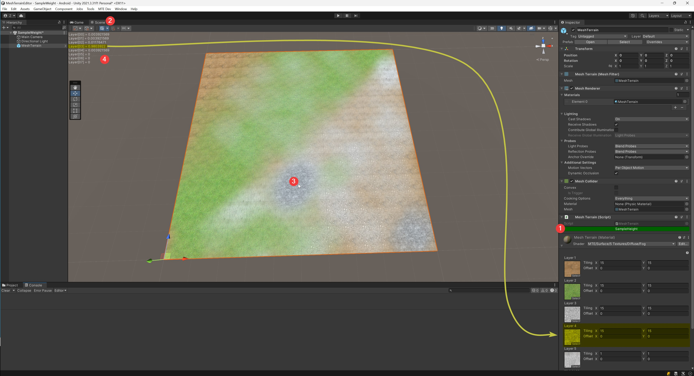

1. Enable MeshTerrain SampleHeight 启用MeshTerrain组件的SampleHeight功能
2. Open scene view 打开场景页
3. Put mouse on the mesh-terarin 将鼠标移动到MTE模型上
4. Displays each layers' weight at mouse's position 显示鼠标位置处的每一层的权重值